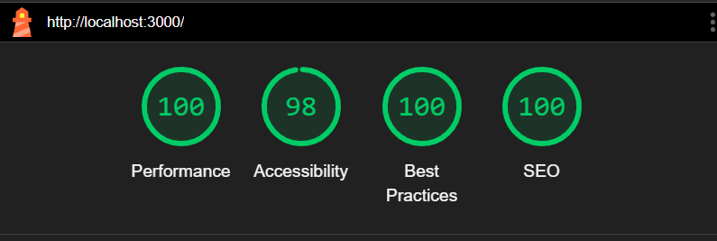
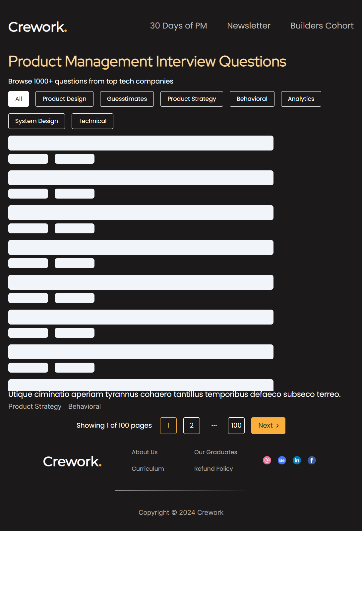
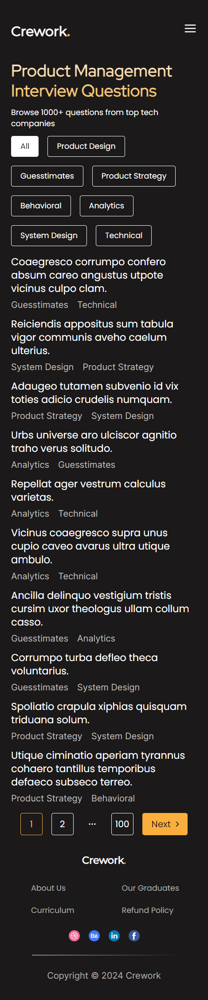
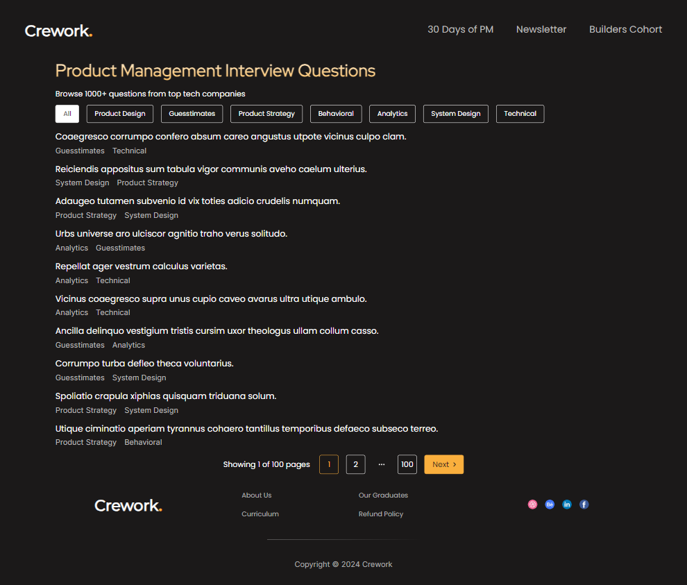

# Crework Internship  Assignment

The above assignment is deployed here <https://crework-assignment-two.vercel.app/>

## Getting Started

If you want to run the project locally, you can clone the repository and run this repo through two methods:

### Method 1: Using nodejs

1. Make sure you have nodejs installed in your system. If not, you can download it from [here](https://nodejs.org/en/download/).
2. Go to the folder where you have cloned the repository.
3. Run the following commands in the terminal:

```bash
pnpm dev 
# or your preferred package manager
```

### Method 2: Using Docker

1. Make sure you have docker installed in your system. If not, you can download it from [here](https://www.docker.com/products/docker-desktop).
2. Go to the folder where you have cloned the repository.
3. Run the following commands in the terminal:

```bash
docker build -t crework-assignment .
```

```bash
docker run -p 3000:3000 crework-assignment
```

## Tech Stack

- Next.js
- Tailwind CSS
- TypeScript
- RTK Query
- Shadcn UI

## Features

- [x] Responsive Design
- [x] Pagination through query params rather than state
- [X] Skeleton Loading
- [X] have added proper metadata instead of an Create Next App and vercel svg as favicon

## Images

- LightHouse Score


- Skeleton Loading


- Mobile Demo


- Desktop Demo


Hope you like the assignment